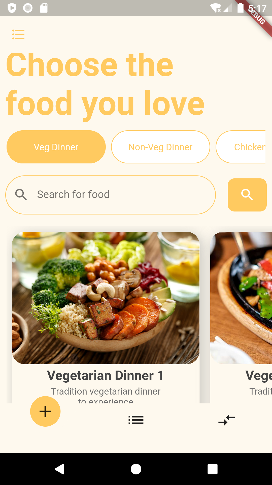
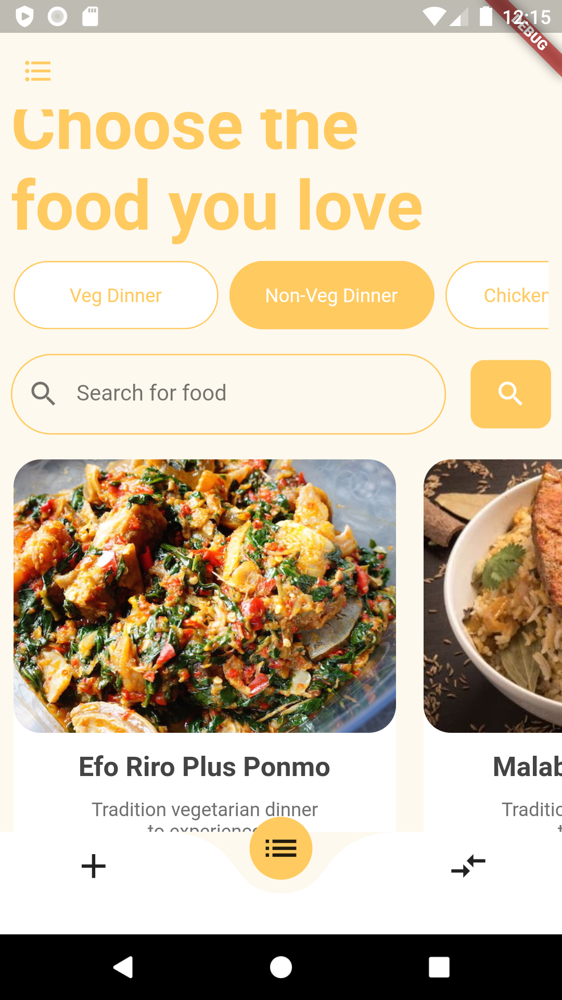
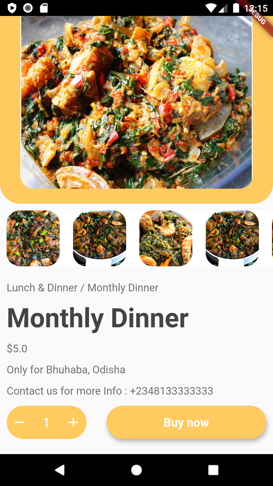
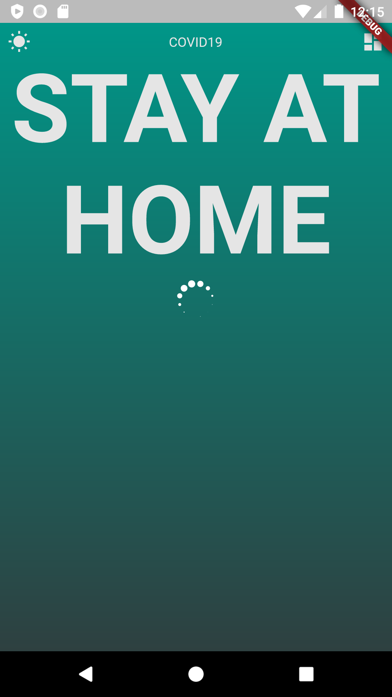
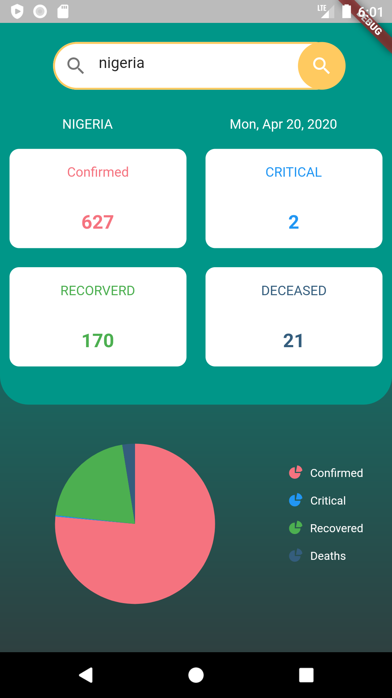

# flutter_ui_challenges

A new Flutter application.

## Getting Started

This  me recreating some designs i saw on dribble.

The Food App: the design is by https://dribbble.com/aichdesign

    

The Covid App : the design is inspired by  https://dribbble.com/aichdesign

    

This project is a starting point for a Flutter application.

A few resources to get you started if this is your first Flutter project:

- [Lab: Write your first Flutter app](https://flutter.dev/docs/get-started/codelab)
- [Cookbook: Useful Flutter samples](https://flutter.dev/docs/cookbook)

For help getting started with Flutter, view our
[online documentation](https://flutter.dev/docs), which offers tutorials,
samples, guidance on mobile development, and a full API reference.
